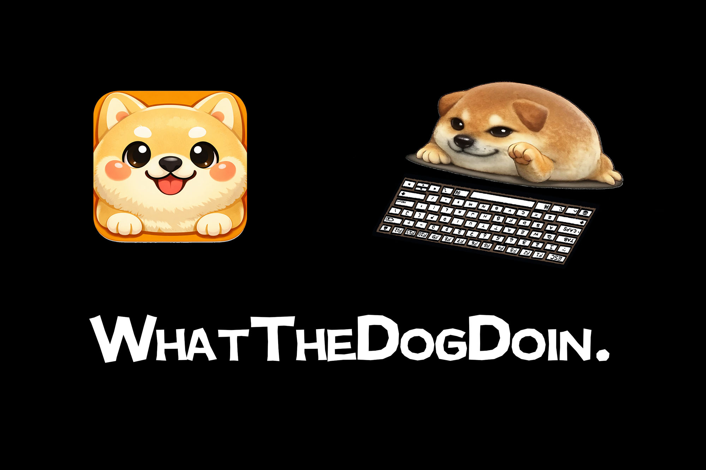

# WhatTheDogDoin 🐾

> *You track your steps. You track your calories. Meet the app that tracks your typing.*

**WhatTheDogDoin** is an AI-powered desktop companion that sits in the corner of your screen, reacts to every keystroke with live animations, and quietly logs your typing patterns — without ever getting in your way. At the end of the day, ask it how you did. It'll tell you your WPM, your busiest hours, your most-hammered keys — and roast you with a Claude AI-generated personality label like *"3am Code Goblin"* or *"Backspace Champion"*.

Built at **UNIHACK 2026** in 48 hours.



## Features

- 🐶 **Live key animations** — every keystroke triggers a matching hand sprite on your desktop dog
- 📊 **Typing stats** — daily keystroke count, WPM tracking, per-key frequency breakdown
- 📅 **Weekly overview** — bar chart of your typing volume across the past 7 days
- 🤖 **AI personality analysis** — Claude AI reads your typing data and gives you a daily roast + label
- 🖱 **Pass-through mode** — click straight through the pet; it stays on screen without blocking anything
- 🌐 **Bilingual** — full English / 中文 support
- 🔒 **Local-first** — all data stored on-device via SQLite, nothing leaves your machine

---

## Demo

<video src="media/demo.mp4" controls width="100%"></video>

---

## Tech Stack

| Layer | Technology |
|---|---|
| Desktop shell | [Tauri 2](https://tauri.app) (Rust) |
| Frontend | Vue 3 + TypeScript + Vite |
| Keyboard listener | [`rdev`](https://crates.io/crates/rdev) |
| Database | SQLite via `rusqlite` |
| Animation | Layered sprite images |


---

## Getting Started

### Prerequisites

- [Node.js](https://nodejs.org) ≥ 18
- [Rust](https://rustup.rs) (stable)
- macOS 12+

### Run in development

```bash
git clone https://github.com/your-org/whatthedogdoin.git
cd whatthedogdoin
npm install
npm run tauri dev
```

> **macOS note:** On first launch, grant **Input Monitoring** permission when prompted (`System Settings → Privacy & Security → Input Monitoring`), then restart the app. This is required for global keyboard listening.

### Build for production

```bash
npm run tauri build
```

The installer will be in `src-tauri/target/release/bundle/`.

---

## Project Structure

```
whatthedogdoin/
├── src/                  # Vue 3 frontend
│   └── App.vue           # Main UI: pet animation, stats panel, AI bubble
├── src-tauri/
│   ├── src/
│   │   └── lib.rs        # Rust backend: keyboard listener, DB, Claude API
│   └── tauri.conf.json   # Window config (transparent, always-on-top)
└── public/
    └── sprites/          # Key sprite images
```

---

## Authors

Built with too much caffeine and zero sleep at UNIHACK 2026.

| Name | GitHub |
|---|---|
| Mai Ding | [@dmnbme](https://github.com/dmnbme) |
| Zihang Wei (Ethan) | [@Ethan071711](https://github.com/Ethan071711) |
| Yu Pang (Patrick) | — |
| Yutong Wang (Vincent) | — |

---

## License

MIT © 2026 WhatTheDogDoin Team
